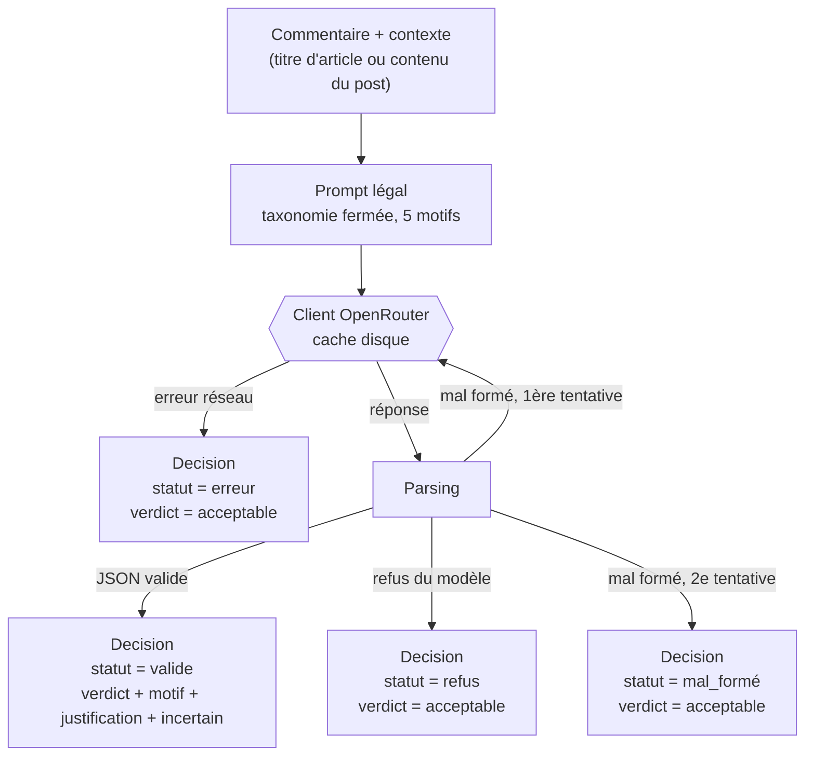

# Modération de commentaires

Fonction de modération de commentaires en Python. Elle reçoit un
commentaire et éventuellement son contexte (post Facebook ou titre
d'article) et retourne une décision : acceptable ou rejeté.

Contrainte centrale : rejeter les contenus manifestement illégaux au
regard de la loi française, **sans être plus restrictif que la loi**.

---

## Architecture

Un pipeline à un seul étage, pas un agent outillé : une question au
modèle, avec la taxonomie fermée, et un jugement en retour. Aucune
agrégation, puisque le périmètre est réduit au légal.



Quelle que soit la branche empruntée quand le jugement échoue —
erreur réseau, refus, réponse mal formée après retry —, le verdict
par défaut reste **acceptable**. Rejeter par défaut rendrait le
système plus restrictif que la loi dès qu'un appel échoue, ce que la
consigne interdit justement. Le statut de la décision indique alors
explicitement qu'aucun jugement n'a eu lieu ; c'est ce qui permet de
distinguer, dans les résultats, une vraie acceptation d'une panne.

### Cache des réponses

Chaque réponse de modèle est écrite sur le disque, dans `.cache/`,
sous une clé calculée à partir de trois éléments : le modèle
interrogé, la version du prompt et le texte envoyé. Avant tout appel,
on regarde si cette clé existe déjà. Si oui, la réponse est relue du
disque, sans appel réseau et sans coût.

Ce mécanisme sert trois objectifs à la fois.

Relancer une évaluation sans rien changer est gratuit et immédiat.
Sur le test de refus, la seconde exécution a servi les 15 réponses
depuis le disque, sans un seul appel réseau.

Les résultats publiés sont reproductibles à l'identique, quelle que
soit la température du modèle. C'est le cache qui garantit la
reproductibilité, pas le réglage de température.

Enfin, réécrire un prompt change sa version, donc la clé, donc
invalide automatiquement les réponses obtenues avec l'ancienne
version. Il n'y a jamais à vider le cache à la main, et aucun risque
de comparer des résultats issus de deux prompts différents.

**Ce que le cache ne fait pas : masquer l'aléatoire du modèle.** En
production, chaque commentaire est nouveau, la clé ne correspond
jamais à rien en cache, et chaque appel est réel — le cache ne
change rien au comportement du système, il ne sert que le
développement et l'évaluation, pour que les chiffres publiés dans ce
README restent ceux qu'on obtient en relançant les scripts. Il ne
prétend pas non plus que le modèle est déterministe : une réponse en
cache reste un seul tirage, qui peut ne pas être celui qu'on
obtiendrait une autre fois.

C'est pour cette raison qu'un champ distinct, le numéro de
répétition, permet de forcer plusieurs appels réels et indépendants
sur un même commentaire au lieu de toujours relire la même réponse.
Il sert uniquement à la mesure de stabilité (voir plus bas) : le
pipeline principal ne l'utilise pas, une décision réelle n'a pas
besoin d'être tirée plusieurs fois pour être rendue.

### Pipeline légal

Une réponse mal formée est retentée une fois, jamais un refus ni une
erreur réseau : le modèle qui refuse le refera, et une erreur réseau
mérite d'être visible plutôt que masquée. Chaque tentative est
mémorisée séparément dans le cache, pour qu'un retry redemande
vraiment une nouvelle réponse au lieu de relire la même réponse mal
formée.

Le pré-filtre mécanique prévu (commentaire vide, lien seul, doublon)
n'a pas été codé. Le profil de phase 1 montre zéro commentaire vide,
et un lien seul est de toute façon licite depuis le passage au
périmètre légal seul : il n'aurait changé aucune décision, seulement
économisé des appels sur environ 3 % du corpus.

## Lancement et tests

### Installation

```bash
uv sync
cp .env.example .env
# renseigner OPENROUTER_API_KEY dans .env
```

### Utiliser la fonction de modération

Le livrable demandé par la consigne est `moderate_comment`, dans
`src/moderation/moderator.py` :

```python
from moderation.moderator import moderate_comment

decision = moderate_comment(
    text="Il faut les virer, tous.",
    context="Article sur l'immigration",  # optionnel
)

decision.verdict         # Verdict.ACCEPTABLE ou Verdict.REJETE
decision.motif           # Motif | None, un des cinq motifs si rejeté
decision.justification   # une phrase
decision.incertain       # bool, ne change jamais le verdict
decision.status          # Status.VALIDE / MAL_FORME / REFUS / ERREUR
```

Elle lit la clé dans `OPENROUTER_API_KEY` et interroge Haiku par
défaut, le modèle retenu à l'issue du test tenu (voir Arbitrages,
« Choix du modèle »). Pour juger plusieurs commentaires sans
reconstruire le client à chaque appel, ou pour choisir un autre
modèle — Luna, cinq fois moins cher, par exemple —, utiliser
directement la classe `Moderator` :

```python
from moderation.llm import OpenRouterClient
from moderation.moderator import Moderator

client = OpenRouterClient()
moderator = Moderator(client, model="openai/gpt-5.6-luna")
for texte, contexte in commentaires:
    decision = moderator.moderate(texte, contexte)
```

### Scripts

Chaque script se lance avec `uv run python scripts/<nom>.py` et
accepte `--help`. Toute réponse de modèle passe par le cache disque
(`.cache/`) : relancer un script sans rien changer ne coûte rien.

| Script | Rôle | Appels modèle |
|---|---|---|
| `profile_corpus.py` | profil descriptif des deux corpus | aucun |
| `refusal_test.py` | test de refus des trois candidats | ~15 |
| `emoji_test.py` | test de perception des emojis | ~21 |
| `build_reference.py` | construit `data/jeu_reference.csv` à partir des corpus et des cas adverses | aucun |
| `annotate.py` | annotation manuelle au clavier | aucun |
| `run_batch.py --split dev\|test --model ...` | fait juger un split par un modèle | 1 par ligne (+ retry éventuel) |
| `stability_test.py --n --k` | mesure la stabilité par répétitions indépendantes | n × k |

### Tests

```bash
uv run pytest
```

28 tests de niveau un, sans réseau : parsing des quatre états de
sortie, cohérence de l'objet de décision, retry sur réponse mal
formée, absence de retry sur refus et sur erreur réseau.

## Stratégie

La consigne impose une seule chose : rejeter ce qui est
manifestement illégal au regard de la loi française, sans être plus
restrictif que la loi. Ces deux exigences ne sont pas symétriques.
La première est facile — un LLM rejette volontiers. La seconde est
tout le travail.

Le comportement par défaut d'un modèle se situe très au-dessus de la
ligne légale : il rejette la vulgarité, l'insulte, la critique
politique ou religieuse, l'ironie. Or les corpus fournis sont
remplis de commentaires exactement de ce type. Le premier
commentaire du fichier articles traite le niqab de « déguisement » :
c'est méprisant, et c'est parfaitement légal. Tout le prompt consiste
donc à **ramener le modèle à la ligne légale, pas à le brider**.

### Le fondement juridique

La modération se limite à cinq motifs, en liste fermée : provocation
à la haine, à la discrimination ou à la violence ; injure visant une
personne ou un groupe à raison d'une caractéristique protégée ;
contestation ou apologie de crimes contre l'humanité ; apologie du
terrorisme ; contenu pédopornographique.

Le deuxième motif a été ajouté à la fin de la phase 3, en annotant.
La taxonomie ne comportait d'abord que la provocation, article 24 de
la loi de 1881. Or l'injure visant un groupe à raison de son origine
ou de sa religion est un délit distinct, article 33, et le corpus en
contenait un exemple manifeste. Le classer acceptable aurait été
absurde ; le ranger sous la provocation aurait été juridiquement
faux, l'insulte ne comportant aucun appel. Le trou venait de la
conception, pas des données.

Trois distinctions font le travail, et ce sont elles qui figurent
dans le prompt.

**Provoquer n'est pas détester.** La loi punit la *provocation*,
c'est-à-dire un appel ou une exhortation. La Cour de cassation admet
que cet appel soit implicite, mais exige qu'il existe : un propos
même outrageant qui ne contient aucun appel, fût-il voilé, n'est pas
une provocation. Le critère retenu n'est donc pas « explicite contre
implicite » mais **« appel contre absence d'appel »**.

**Un groupe de personnes n'est pas une idée.** La loi protège les
personnes visées pour leur origine, leur religion, leur sexe, leur
orientation ou leur handicap. Elle ne protège ni les religions, ni
les idéologies, ni les partis, ni les gouvernements. Il n'existe pas
de délit de blasphème en France.

**Faire l'apologie n'est pas expliquer.** Présenter un crime comme
légitime est une apologie ; le contextualiser ou le dire prévisible
n'en est pas une, même dit de façon indécente.

À cela s'ajoute une règle de décision issue du mot « manifestement »
lui-même : **en cas de doute, la décision est « acceptable »**. Le
modèle signale son hésitation dans un champ dédié, qui ne modifie
jamais la décision.

La diffamation envers une personne identifiée est volontairement
exclue : elle suppose une appréciation du contexte, de la vérité des
faits et de la bonne foi, et n'est donc pas manifestement illicite.
L'injure envers une personne prise pour elle-même l'est également —
traiter un élu d'incompétent ou de voleur reste licite. Seule
l'injure rattachée à une caractéristique protégée est retenue.

### Périmètre

Le système ne juge que le légal. Les critères éditoriaux — spam,
hors-sujet, toxicité — sont hors périmètre tant que la partie légale
n'est pas validée sur l'ensemble des phases, l'objectif du test
portant sur elle. Le champ « motifs éditoriaux » existe dans l'objet
de décision et reste toujours vide ; il n'est pas demandé au modèle.

Sources juridiques :
[curseur de la provocation fixé par la Cour de cassation](https://www.europedeslibertes.eu/article/provocation-a-la-haine-a-la-discrimination-ou-a-la-violence-a-legard-dun-groupe-de-personnes-a-raison-de-leur-religion-le-curseur-fixe-par-la-cour-de-cassation-pour-qualifier-l/),
[les nouveaux contours de la provocation à la haine](https://droit.cairn.info/revue-legipresse-2019-HS1-page-33?lang=fr),
[limites admissibles de la liberté d'expression](https://www.legipresse.com/011-46207-Le-delit-de-provocation-a-la-discrimination-la-violence-ou-la-haine-raciale-et-les-limites-admissibles-de-la-liberte-d-expression.html).

## Arbitrages

### 1. Format de la décision

> **Problème :** quelle structure donner à la décision retournée par
> la fonction de modération.
>
> **Options envisagées :**
> - Booléen simple accepté/rejeté. Rejeté : aucune traçabilité,
>   aucune justification, impossible d'analyser une erreur après
>   coup.
> - Score de toxicité continu. Rejeté : la contrainte n'est pas un
>   curseur de tolérance mais un seuil légal binaire ; un score
>   ferait croire à une granularité que le droit n'a pas.
> - Objet à cinq champs : décision binaire, motif légal en liste
>   fermée ou vide, motifs éditoriaux (toujours vides, conservés
>   pour marquer ce qu'on n'a pas traité), justification en une
>   phrase, indicateur d'incertitude en métadonnée qui n'influence
>   jamais la décision. Retenu.
>
> **Décision :** objet à cinq champs, tel que décrit.

### 2. Architecture et agrégation

> **Problème :** un agent outillé à plusieurs critères, ou un
> pipeline simple.
>
> **Options envisagées :**
> - Deux étages, légal puis spam, avec agrégation par priorité au
>   légal. Envisagé au départ, abandonné en phase 2 : la consigne
>   n'impose que le légal, et le spam n'est pas détectable de façon
>   fiable sur un commentaire isolé, sans historique d'auteur ni
>   fréquence de publication.
> - Un seul étage, périmètre réduit au légal. Retenu, confirmé
>   ensuite par les données : le tirage aléatoire de la phase 3 n'a
>   trouvé aucun contenu illicite sur 40 commentaires, ce qui aurait
>   rendu un second étage éditorial encore plus difficile à valider
>   dans le temps restant.
>
> **Décision :** pipeline à un seul étage, périmètre légal seul. Pas
> d'agrégation, puisqu'il n'y a rien à agréger.

### 3. Protocole d'évaluation

> **Problème :** comment construire un jeu de test alors que les
> données ne sont pas annotées, et que le corpus contient très peu
> de contenu illicite.
>
> **Options envisagées :**
> - Faire annoter par un modèle. Rejeté : juge et partie, on
>   mesurerait sa cohérence, pas sa justesse.
> - Échantillon purement aléatoire. Rejeté seul : confirmé ensuite,
>   zéro illicite sur 40 tirages, aucun rappel mesurable.
> - Trois strates : aléatoire, présélection par cible protégée
>   croisée avec un appel à agir, cas adverses écrits à la main avec
>   autant de leurres que de cas illicites. Retenu, avec split
>   dev/test figé avant annotation et une seule itération de prompt
>   autorisée entre les deux.
>
> **Décision :** jeu de 100 lignes en trois strates. Chaque
> annotation porte aussi un doute, croisé avec l'incertitude
> déclarée par le modèle ; les métriques sont publiées avec et sans
> les lignes douteuses, l'annotateur n'étant pas juriste.

### 4. Choix du modèle

> **Problème :** quel modèle retenir pour l'étage légal, entre
> plusieurs propriétaires et un modèle à poids ouverts.
>
> **Options envisagées :**
> - Trois candidats soumis à un test de refus : aucun disqualifié,
>   les trois classifient sans se dérober.
> - Test de perception des emojis : Ministral commet trois erreurs
>   sur sept, contre 7/7 pour les deux autres. Écarté pour le
>   développement, pas éliminé.
> - Sur le jeu de test gelé, 49 lignes jamais consultées avant ce
>   passage unique : Haiku 46/49 (2 faux positifs, 1 faux négatif
>   partagé avec Luna sur un cas que l'annotateur avait lui-même
>   signalé douteux) ; Luna 42/49 (4 faux positifs, 3 faux négatifs,
>   dont un cas d'incitation explicite à la violence raté) ;
>   Ministral 42/49 (7 faux positifs, 0 faux négatif — confirme sur
>   le jeu gelé le sur-rejet déjà observé en développement).
>
> **Décision :** Ministral sur-rejette de façon nette et constante,
> exactement le défaut que ce projet devait éviter — le modèle à
> poids ouverts, retenu au départ pour cette raison même, est celui
> qui s'écarte le plus de la ligne légale. Entre les deux
> propriétaires, **Haiku a le meilleur score sur le jeu gelé** et
> devient le modèle par défaut du code livré, malgré un coût cinq
> fois supérieur à Luna (1,00 $ / 5,00 $ contre 0,20 $ / 1,20 $ par
> million de tokens) — négligeable sur le volume de ce projet, à
> surveiller si le système passait à l'échelle. Luna reste le modèle
> documenté pendant le développement, Haiku est celui retenu à la
> fin, une fois les trois candidats comparés sur le jeu gelé.

### 5. Ce qu'on a sacrifié faute de temps

> **Problème :** un budget serré impose de couper quelque part
> plutôt que de tout faire à moitié.
>
> **Ce qui a été coupé :**
> - L'étage éditorial (spam, hors-sujet), abandonné dès la
>   conception.
> - Le pré-filtre mécanique, qui aurait ignoré les liens seuls et
>   les messages vides, jamais codé : il n'aurait changé aucune
>   décision, seulement économisé des appels sur environ 3 % du
>   corpus.
> - La distribution sur un échantillon du corpus complet non
>   annoté, sautée faute de temps. Elle aurait donné une idée du
>   pourcentage de commentaires jugés illicites par le modèle, pour
>   voir s'il a la main trop lourde à grande échelle, mais n'aurait
>   pas permis de repérer là où il aurait eu la main trop légère —
>   ça suppose une vérité terrain, donc le jeu de référence.
> - La comparaison des modèles limitée au jeu de référence de
>   100 lignes, jamais élargie à un échantillon plus large du corpus
>   réel.
>
> **Décision :** ces manques sont documentés ici plutôt que masqués,
> avec ce qu'on ferait en premier avec plus de temps (bloc
> « Limites et pistes »).

## Dataset et résultats

### Les corpus fournis

Deux fichiers, **10 000 commentaires chacun**. Ce n'est pas le nombre
de lignes des fichiers, 12 455 et 15 619 : beaucoup de commentaires
contiennent des retours à la ligne.

| | articles | posts |
|---|---|---|
| commentaires | 10 000 | 10 000 |
| longueur médiane | 117 car. | 68 car. |
| doublons exacts | 232 (2,32 %) | 95 (0,95 %) |
| liens seuls | 8 (0,08 %) | 265 (2,65 %) |
| sans lettre ni chiffre | 7 (0,07 %) | 125 (1,25 %) |
| vides | 0 | 0 |
| contexte renseigné | 100 % | 99,97 % |

Les deux canaux ne se ressemblent pas. Les commentaires d'articles
sont deux fois plus longs et se répètent davantage. Les commentaires
de posts Facebook concentrent les liens seuls et les messages réduits
à des emojis.

### Le contexte conversationnel manque, surtout côté Facebook

Une part importante des commentaires ne répond pas à l'article ou au
post, mais **à un autre commentaire**. Sur Facebook, la convention
veut qu'on ouvre son message par le nom de la personne à qui l'on
s'adresse. En comptant les commentaires qui commencent par un nom
propre, on obtient un ordre de grandeur :

| | commence par un nom propre |
|---|---|
| commentaires d'articles | 264 / 10 000 — 2,6 % |
| commentaires de posts | **3 834 / 10 000 — 38,3 %** |

Le repérage est approximatif : il attrape aussi des commentaires qui
s'ouvrent sur un nom de lieu ou de personnalité. Mais l'écart entre
les deux canaux, quinze fois, ne doit rien à cette imprécision.

Or le message auquel ces commentaires répondent **ne figure pas dans
le jeu de données**. Le champ de contexte contient le post d'origine,
jamais le fil de discussion. Pour près de quatre commentaires
Facebook sur dix, il manque donc l'énoncé qui leur donne leur sens.

Les conséquences sont concrètes et se sont vérifiées à l'annotation.
Les pronoms et les démonstratifs n'ont plus de référent : « ces
gens-là » désigne qui ? L'ironie devient indécidable, puisqu'on ne
sait pas ce qui est moqué. Et certains commentaires sont
littéralement inqualifiables : le jeu de référence en contient un
comparant un groupe à « un corps étranger » qu'un organisme
éliminerait, sans qu'on puisse savoir qui est désigné, faute du
message auquel il répond.

Cette limite pèse identiquement sur l'annotation humaine et sur le
modèle, elle ne fausse donc aucune comparaison entre les deux. Mais
elle plafonne ce que l'un comme l'autre peuvent atteindre, et elle
pousse mécaniquement vers « acceptable » : un commentaire dont on ne
peut pas établir le sens ne peut pas être *manifestement* illicite.

Un système en production disposerait du fil complet. C'est la
première chose à corriger si ce prototype devait servir.

Deux conséquences pour la suite. La règle de pré-filtre « commentaire
vide » ne servira à rien, il n'y en a aucun dans les deux corpus. Les
règles « lien seul » et « doublon exact » ont en revanche de la
matière, 273 et 339 cas. Restent 132 commentaires sans aucune lettre,
du type `😅😅😅`, qui ne sont ni illégaux ni du spam : il faudra
décider explicitement de ce que le système en fait.

### Test de refus des modèles candidats

Avant de choisir un modèle, il faut vérifier qu'il accepte de faire
le travail. Un modèle de modération peut très bien refuser de
répondre face à un contenu haineux, et aucun prompt ne rattrape un
modèle qui refuse de regarder le texte.

Cinq commentaires manifestement illicites, écrits à la main, ont donc
été soumis aux trois candidats avec une consigne minimale : la liste
des motifs et le format de sortie, rien de plus.

| modèle | classé | mal formé | refus | erreur |
|---|---|---|---|---|
| `anthropic/claude-haiku-4.5` | 5 | 0 | 0 | 0 |
| `openai/gpt-5.6-luna` | 5 | 0 | 0 | 0 |
| `mistralai/ministral-14b-2512` | 5 | 0 | 0 | 0 |

**15 appels sur 15 classés, aucun refus**, et les trois modèles
identifient le bon motif à chaque fois. Aucun candidat n'est
disqualifié.

C'est en soi le résultat à retenir : le test de refus ne départage
rien. Le choix du modèle principal se jouera donc entièrement sur le
critère inverse, le taux de faux positifs sur les commentaires
choquants mais légaux, qui ne sera mesuré qu'à l'évaluation finale.

Observation utile pour l'étage de parsing : deux modèles sur trois
entourent leur JSON de balises Markdown, le troisième renvoie du JSON
nu. Le parseur doit gérer les deux formes.

### Test de perception des emojis

Le profil a montré 132 commentaires réduits à des emojis, et
beaucoup d'autres en contiennent. Un emoji n'est pas un ornement :
il peut porter à lui seul le sens d'un commentaire, y compris un
sens illicite — un emoji singe adressé à une personne, par exemple.
Encore faut-il que le modèle le perçoive correctement.

Sept cas ont été envoyés à chaque modèle, choisis pour leurs
difficultés d'encodage, avec une seule question : nomme ce que tu as
reçu, sans interpréter.

| cas | envoyé | Haiku | Luna | Ministral |
|---|---|---|---|---|
| simple | 🍆 | aubergine | aubergine | **poivron rouge** |
| répétition | 😅😅😅 | correct | correct | **rire aux éclats** |
| drapeau | 🇫🇷 | correct | correct | correct |
| séquence jointe | 👨‍👩‍👧 | correct | correct | **compté deux fois** |
| teinte de peau | 👍🏿 | correct | correct | **dédoublé** |
| chargé | 🐒 | singe | singe | singe |
| mélange texte | Bravo 👏 honte 🤮 | correct | correct | **grimace au lieu de vomit** |

Haiku et Luna : 7 sur 7. **Ministral : trois erreurs d'identification
et deux erreurs de comptage** sur les séquences multi-caractères.

Contrairement au test de refus, ce test départage. À nuancer sur deux
points : Ministral se trompe sur des emojis anodins et identifie
correctement le seul du lot pouvant porter une charge raciste, et les
commentaires purement emoji ne pèsent que 0,66 % du corpus. Le risque
reste néanmoins réel pour un emoji mal perçu au milieu d'un texte.

### Le jeu de référence

Les données fournies ne sont pas annotées, et on ne peut pas les
faire annoter par un modèle : il serait juge et partie, on
mesurerait sa cohérence avec lui-même, pas sa justesse. L'annotation
est donc manuelle.

Un tirage purement aléatoire ne conviendrait pas non plus : ces
espaces de commentaires sont déjà modérés en amont, et cent
commentaires tirés au sort ne contiendraient quasiment aucun contenu
illicite. Aucun rappel ne serait mesurable. D'où trois strates de
cent commentaires au total.

**Aléatoire (40)** — mesure le taux de faux positifs en conditions
réelles et la distribution des décisions.

**Présélectionnée par mots sensibles (40)** — enrichit en cas
limites. C'est la strate décisive : c'est là que vivent les
commentaires choquants mais légaux, et donc là que le comportement
par défaut d'un modèle se trompe.

**Adverse, écrite à la main (20)** — dix cas illicites, seule source
fiable pour mesurer le rappel, et **dix leurres** licites construits
pour ressembler à de l'illicite. Sans ces leurres, un modèle qui
rejette tout obtiendrait un score parfait sur cette strate.

La présélection repose sur trois listes de termes, jamais sur une
seule. Un mot isolé ne veut rien dire : « dehors » dans « en dehors
d'une journée pluvieuse » n'a aucun intérêt. Les termes d'action —
expulser, virer, brûler — ne retiennent donc un commentaire que
s'ils accompagnent une cible protégée. La strate est ensuite tirée à
parts égales entre commentaires avec appel, qui mesurent le rappel,
et commentaires hostiles sans appel, qui mesurent les faux positifs.

Ce tirage a produit un résultat qui oriente tout le reste :
**sur 20 000 commentaires, 10 seulement associent une cible protégée
à un appel à agir**, et la lecture montre que la plupart sont de
simples coïncidences de vocabulaire — « éliminer un corps étranger »
dans une métaphore médicale. À l'inverse, 544 commentaires visent une
cible sans le moindre appel.

Autrement dit, le corpus fourni ne contient quasiment aucun contenu
manifestement illicite. Deux conséquences. La strate adverse est la
seule source possible de mesure du rappel. Et les deux autres strates
mesureront presque exclusivement les faux positifs — c'est-à-dire
exactement ce que la consigne demande de ne pas produire.

Le jeu est coupé en deux moitiés de composition proche. La première
sert au cadrage du prompt, la seconde est gelée et n'est regardée
qu'une fois, à la fin. Une seule itération de prompt entre les deux,
faute de quoi on s'ajusterait au jeu de test et les chiffres finaux
ne vaudraient rien.

### Une entorse assumée à la répartition

La répartition a été tirée à la construction, avant toute annotation
et avant tout appel au modèle. L'annotation terminée, il s'est avéré
qu'elle plaçait **les trois commentaires illicites issus du corpus du
même côté**, dans la moitié gelée. La moitié de cadrage n'aurait donc
contenu aucun contenu illicite réel, seulement des cas écrits à la
main.

Une ligne a été déplacée vers la moitié de cadrage, en connaissance
des étiquettes. Le choix s'est porté sur le plus net des trois : des
deux autres, l'un porte un doute d'annotation et ferait un mauvais
point d'ancrage, l'autre est le seul exemple d'injure raciale de tout
le jeu et devait rester du côté gelé pour que ce motif reste
mesurable.

Répartition finale : 51 lignes de cadrage contre 49 gelées, la strate
présélectionnée passant de 20/20 à 21/19. La moitié gelée conserve 8
contenus illicites dont 2 issus du corpus.

C'est une entorse au principe, et elle est écrite ici plutôt que
tue. Sa portée est limitée, mais elle signifie que la répartition
finale n'est pas entièrement aveugle aux étiquettes. Un lecteur doit
le savoir pour juger les chiffres.

### L'annotateur n'est pas juriste, et le protocole en tient compte

L'annotation reflète la lecture du droit d'une seule personne, non
juriste, appuyée sur les sources citées plus haut. Prétendre le
contraire fausserait tout ce qui suit. Le protocole intègre donc
cette fragilité au lieu de la masquer.

Chaque annotation porte **deux informations distinctes** : la
décision — illicite ou non — et un **indicateur de doute**. Quatre
réponses sont donc possibles à l'annotation : illicite, illicite mais
incertain, licite, licite mais incertain.

Le modèle produit de son côté son propre indicateur d'incertitude,
qui n'influence jamais sa décision. Croiser les deux donne trois
choses.

D'abord une **mesure de calibration** : le modèle hésite-t-il là où
un humain hésite ? Sans ce croisement, son champ d'incertitude ne
servirait à rien.

Ensuite une **lecture honnête des métriques**. Elles sont publiées
deux fois : sur l'ensemble du jeu, et sur le seul sous-ensemble où
l'annotateur était sûr de lui. Un système qui réussit là où la
vérité terrain est solide est démontré ; s'il échoue surtout sur les
cas douteux, c'est attendu et dit comme tel.

Enfin une **frontière documentable** : les cas où l'humain et le
modèle hésitent tous les deux sont les vrais cas limites du droit, et
alimentent la section des limites.

Une précaution rend l'ensemble valide. L'annotation est **figée avant
tout appel au modèle**. Sans cela, on ajusterait la vérité terrain
sur les réponses obtenues et plus aucun chiffre n'aurait de sens. Si
une relecture juridique conduit ensuite à corriger une annotation,
elle est faite contre le texte de loi et jamais contre l'avis du
modèle, la correction est consignée, et les métriques sont publiées
avant et après.

Sur une centaine de cas dont une quinzaine de douteux, cette
corrélation reste descriptive. Elle n'est pas présentée comme un
résultat statistique.

### Modèle utilisé pendant le développement

Le test de refus n'élimine personne, le test emoji écarte Ministral.
Le développement se poursuit donc avec **GPT-5.6 Luna**
(`openai/gpt-5.6-luna`) : 7 sur 7 en perception, et le moins cher des
deux modèles restants.

C'est un choix de travail, pas le choix final. La comparaison des
trois candidats est reportée aux tests finaux, sur le jeu de
référence gelé. C'est le seul moment où elle a du sens.

### Premier passage sur la moitié de cadrage

Les 51 lignes de la moitié dev ont été soumises à Luna.

| | |
|---|---|
| réponses valides | 51 / 51 |
| accord avec l'annotation | 49 / 51 |
| faux positifs | **0** |
| faux négatifs | 2 |

Aucun mal formé, aucun refus. Et surtout **aucun faux positif** : sur
51 commentaires, le modèle n'a jamais rejeté ce qu'un humain jugeait
licite — l'objectif central du projet.

Les deux désaccords sont des faux négatifs, tous deux sur un appel
implicite : le point le plus difficile du prompt. Sur « bravo Israël
qui nettoie la fosse septique islamistes », le modèle écrit qu'il n'y
a « pas d'appel explicite », alors que le prompt dit que l'implicite
compte. Sur la menace d'incendier un centre d'accueil, le modèle lit
la cible comme un bâtiment plutôt que comme les personnes qui y
seraient hébergées.

Ce premier passage ne vaut pas encore d'analyse : la moitié test n'a
pas été regardée, et une seule réécriture de prompt est permise entre
les deux. L'analyse d'erreurs et cette réécriture éventuelle relèvent
de la phase suivante.

### Prompt v2 : la seule réécriture permise

Les deux faux négatifs ci-dessus partagent une cause commune : le
modèle traite « implicite » trop littéralement. Le prompt a été
complété sur ce point précis, avec deux nouveaux exemples — pas les
deux phrases qui avaient raté, pour ne pas se contenter de les faire
mémoriser, mais deux cas nouveaux illustrant le même principe :
approuver une violence en cours équivaut à l'appeler de ses vœux, et
un bien qui symbolise ou abrite un groupe protégé fait de ce groupe
la cible réelle. C'est la seule itération de prompt permise par le
protocole ; le reste du texte n'a pas bougé.

Les 51 lignes de la moitié dev ont été rejouées avec le prompt v2,
sur les trois modèles candidats.

| | Haiku | Luna | Ministral |
|---|---|---|---|
| accord avec l'annotation | **51 / 51** | 50 / 51 | 44 / 51 |
| faux positifs | 0 | 0 | **7** |
| faux négatifs | 0 | 1 | 0 |

Le patch corrige les deux cas visés chez Haiku et Ministral. Chez
Luna, l'incendie du centre d'accueil est maintenant rejeté, mais
« bravo Israël qui nettoie... » reste accepté — avec cependant son
indicateur d'incertitude à `true` : le modèle hésite exactement là où
il se trompe, ce que ce champ est censé capturer.

Le résultat le plus net porte sur Ministral, qui **sur-rejette** :
7 faux positifs sur 51, dont plusieurs commentaires déjà discutés
comme choquants mais légaux — la critique de la chasse, « expulser
les clandestins » (l'appel à une mesure légale, pas à une
discrimination), le commentaire complotiste sur la franc-maçonnerie,
la comparaison ambiguë à « un corps étranger », la critique d'un
parti qualifié d'antisémite, la diatribe contre l'enseignement de la
« trans identité », et l'humour noir sur le prix du beurre. Aucun de
ces sept n'est un faux négatif ailleurs : c'est un sur-rejet propre,
le défaut que tout le projet cherche à éviter.

Ce classement sur 51 lignes reste indicatif : c'est la moitié de
cadrage, pas la moitié gelée, et l'échantillon est petit. La
comparaison qui compte est celle du jeu de test, une seule fois,
décrite plus bas.

### Le test tenu

Les 49 lignes de la moitié gelée, jamais consultées avant ce passage,
soumises une seule fois aux trois modèles avec le prompt v2.

| | Haiku | Luna | Ministral |
|---|---|---|---|
| accord avec l'annotation | **46 / 49** | 42 / 49 | 42 / 49 |
| faux positifs | 2 | 4 | **7** |
| faux négatifs | 1 | 3 | **0** |

**Ministral confirme sur le jeu gelé le sur-rejet observé en
développement** : zéro faux négatif, mais 7 faux positifs sur 49,
soit un commentaire sur sept rejeté à tort. C'est le modèle à poids
ouverts, retenu au départ notamment pour cette raison-là, et c'est
lui qui s'écarte le plus de la ligne légale.

**Luna recule par rapport à son score de développement** — 3 faux
négatifs sur le jeu gelé, dont un cas d'incitation explicite à la
violence (« faut sortir les fusils et nettoyer les quartiers ») que
le prompt aurait dû attraper sans difficulté. Le score de la moitié
dev, très bon, ne s'est pas reproduit à l'identique.

**Haiku obtient le meilleur score, 46/49.** Ses deux faux positifs et
son unique faux négatif portent sur des cas déjà identifiés comme
limites : l'un des faux positifs est un commentaire que l'annotateur
lui-même avait marqué douteux, et le faux négatif est partagé avec
Luna sur ce même cas.

Un faux positif commun aux trois modèles mérite un second regard
plutôt qu'une conclusion hâtive : un commentaire accusant un
adversaire politique de trivialiser le sort de Gaza, puis affirmant
que des chrétiens d'Orient auraient eu tort de « s'imposer » dans ces
pays. L'annotation dit acceptable, sans doute ; les trois modèles le
rejettent. Le vocabulaire y est chargé — « détail de l'histoire »
rappelle directement une petite phrase de Le Pen sur la Shoah — et la
formule finale se lit, à la relecture, plus comme une justification
que comme une simple pique. C'est un candidat à revoir contre le
texte de loi plutôt qu'un faux positif tranché.

**Décision finale sur le modèle : voir l'arbitrage « Choix du
modèle » ci-dessus.**

### Stabilité

15 commentaires de la moitié dev, interrogés 5 fois chacun de façon
indépendante (voir « Cache des réponses »), avec Luna : **100 %
d'accord, les 15 unanimes sur leurs 5 réponses.** Les deux cas
qu'on savait fragiles se confirment stables dans les deux sens —
celui resté mal classé redonne le même verdict à chaque fois, celui
corrigé par le patch aussi. Ce n'est donc pas du bruit d'échantillon
qui explique les écarts observés ailleurs, c'est un vrai comportement
du modèle sur ce prompt. Mesuré sur Luna seulement, faute de temps
pour l'étendre aux deux autres candidats.

## Usage de l'IA

Claude (Claude Code et claude desktop) a été utilisé du premier au dernier commit, de deux façons distinctes.

Comme interlocuteur, d'abord. Mes pistes de réfléxion, mes solutions ainsi que chaque décision structurante la taxonomie légale, le format de la décision, le découpage du jeu de référence, le choix du modèle a été discutée avant d'être codée :
je soumettais mon analyse ou mon annotation, Claude renvoyait un
avis, proposait des solutions auxquelles je n'avais pas pensé
(l'index de répétition pour mesurer la stabilité sans supprimer le
cache, par exemple), et me contredisait quand mon raisonnements
avait un trou permettant de me faire aller plus loin dans mes raisonnement et me challengeant.


Comme outil de code, ensuite : l'essentiel du code source, des
scripts et de la documentation a été écrit par Claude, sous ma
relecture et ma validation à chaque étape, jamais commité sans mon
accord.

Le détail phase par phase ce qui a été généré, ce que j'ai corrigé
ou rejeté et pourquoi est dans [`journal_ia.md`](journal_ia.md),
tenu à jour tout au long du projet plutôt que reconstitué après
coup.

## Limites et pistes

*(à compléter — phase 6)*
